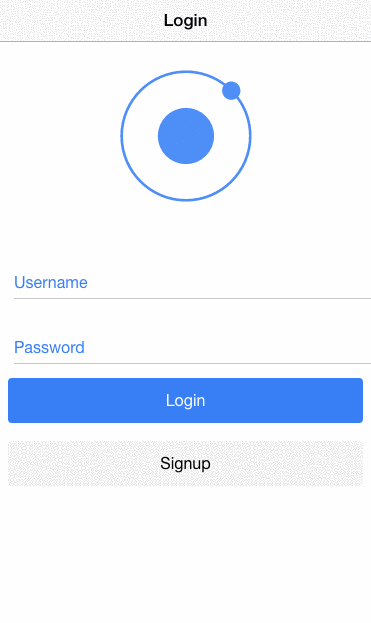
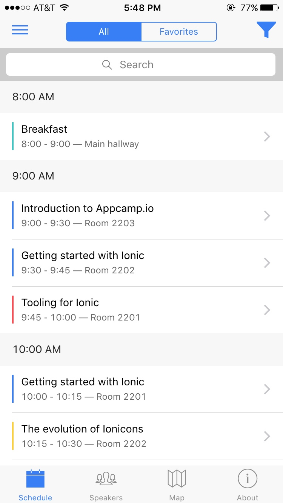
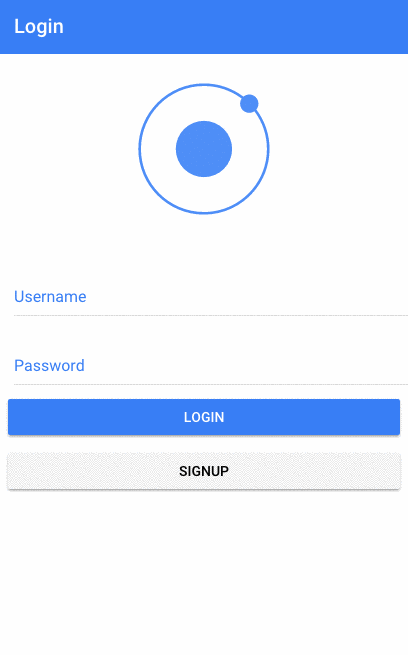
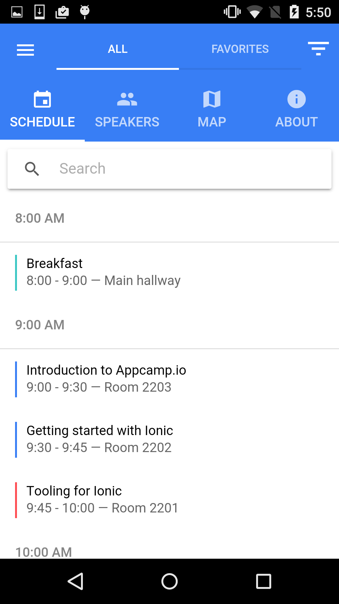

# Cyclone Family Weekend Web Application

THIS PROJECT IS IN ACTIVE DEVELOPMENT


## Table of Contents
 - [App Preview](#app-preview)
  - [iPhone 6](#iphone-6)
  - [Nexus 5](#nexus-5)
 - [File Structure of App](#file-structure-of-app)
 
<!--
## App Preview

### iPhone 6

<!-- GIF of iOS app
<br>-->
<!-- images of iOS app
-->

<!--

### Nexus 5

<!-- GIF of MD app
<br>-->
<!-- GIF of MD app 
-->


## File Structure of App

```
ionic-conference-app/
├── app/                               * Working directory
│   ├── pages/                         * Contains all of our pages
│   │   ├── about/                     * About tab page
│   │   │    ├── about.html            * AboutPage template
│   │   │    └── about.js              * AboutPage code
│   │   │    └── about.scss            * AboutPage stylesheet
│   │   │
│   │   │── map/                       * Map tab page
│   │   │    ├── map.html              * MapPage template
│   │   │    └── map.js                * MapPage code
│   │   │    └── map.scss              * MapPage stylesheet
│   │   │
│   │   │── schedule/                  * Schedule tab page
│   │   │    ├── schedule.html         * SchedulePage template
│   │   │    └── schedule.js           * SchedulePage code
│   │   │    └── schedule.scss         * SchedulePage stylesheet
│   │   │
│   │   │── schedule-filter/           * Schedule Filter page
│   │   │    ├── schedule-filter.html  * ScheduleFilterPage template
│   │   │    └── schedule-filter.js    * ScheduleFilterPage code
│   │   │    └── schedule-filter.scss  * ScheduleFilterPage stylesheet
│   │   │
│   │   │── session-detail/            * Session Detail page
│   │   │    ├── session-detail.html   * SessionDetailPage template
│   │   │    └── session-detail.js     * SessionDetailPage code
│   │   │
│   │   │── tabs/                      * Tabs page
│   │   │    ├── tabs.html             * TabsPage template
│   │   │    └── tabs.js               * TabsPage code
│   │   │
│   │   └── tutorial/                  * Tutorial Intro page
│   │        ├── tutorial.html         * TutorialPage template
│   │        └── tutorial.js           * TutorialPage code
│   │        └── tutorial.scss         * TutorialPage stylesheet
│   │
│   ├── providers/                     * Contains all Injectables
│   │   ├── conference-data.js         * ConferenceData code
│   │   └── user-data.js               * UserData code
│   │
│   ├── app.core.scss                  * App Shared Sass Imports
│   ├── app.html                       * Application template
│   ├── app.ios.scss                   * iOS Sass Imports & Variables
│   ├── app.js                         * Main Application configuration
│   ├── app.md.scss                    * MD Sass Imports & Variables
│   └── app.variables.scss             * App Shared Sass Variables
|
├── node_modules/                      * Node dependencies
|
├── platforms/                         * Cordova generated native platform code
|
├── plugins/                           * Cordova native plugins go
|
├── resources/                         * Images for splash screens and icons
|
├── www/                               * Folder that is copied over to platforms www directory
│   │   
│   ├── build/                         * Contains auto-generated compiled content
│   │     ├── css/                     * Compiled CSS
│   │     ├── fonts/                   * Copied Fonts
│   │     ├── js/                      * ES5 compiled JavaScript
│   │     ├── pages/                   * Copied html pages
│   │     └── app.html                 * Copied app entry point
│   │
│   ├── data/                          * Contains data used for the app
│   │     └── data.json                * App data
│   │
│   ├── img/                           * App images
│   │
│   └── index.html                     * Main entry point
|
├── .editorconfig                      * Defines coding styles between editors
├── .gitignore                         * Example git ignore file
├── config.xml                         * Cordova configuration file
├── CONTRIBUTING.md                    * Information about contributing to this project
├── ionic.config.js                    * Ionic configuration file
├── LICENSE                            * Apache License
├── package.json                       * Our javascript dependencies
├── README.md                          * This file
└── webpack.config.js                  * Webpack configuration file
```
